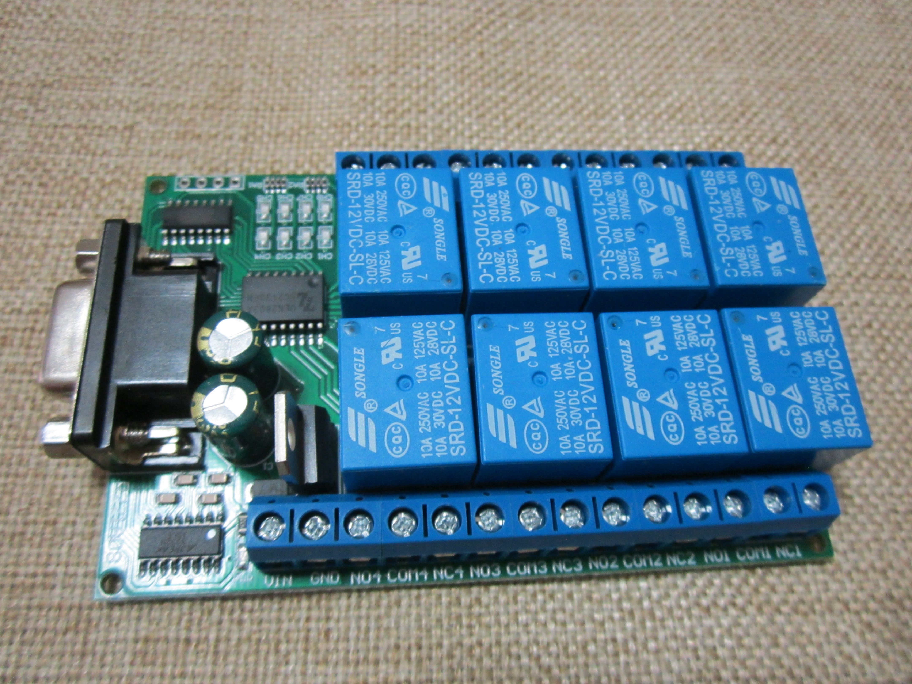
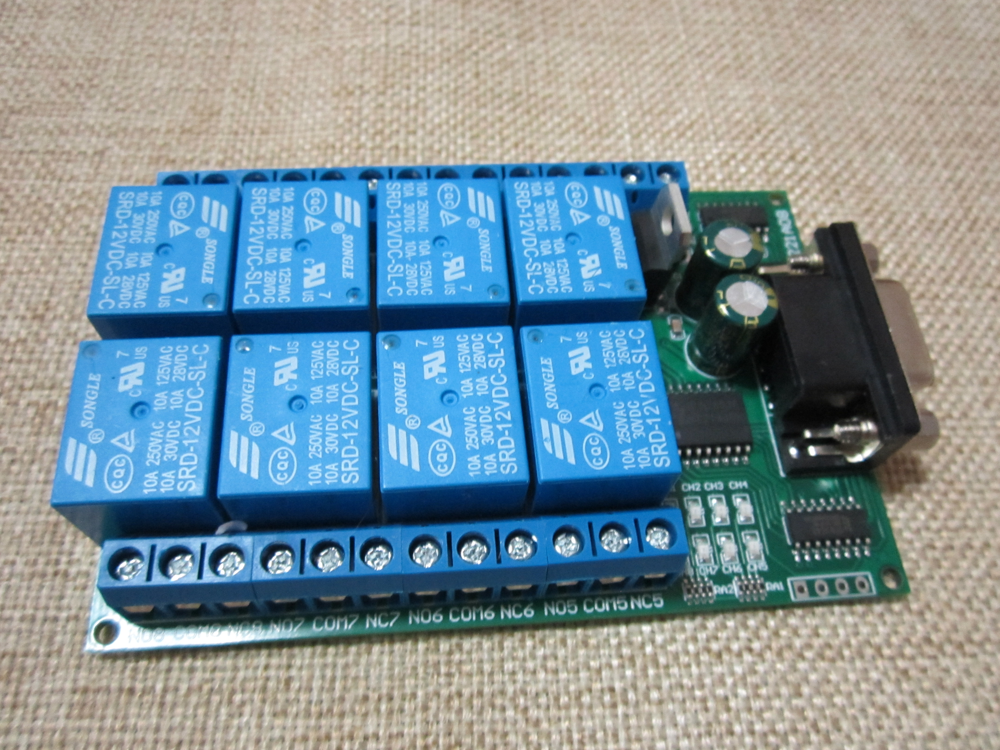
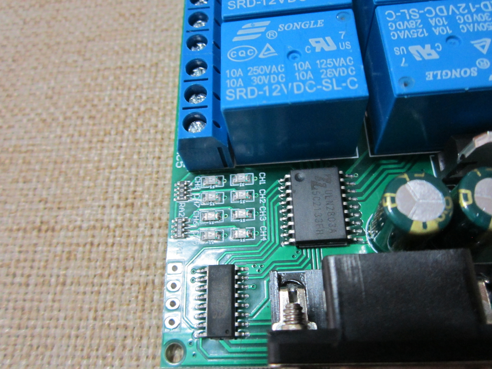
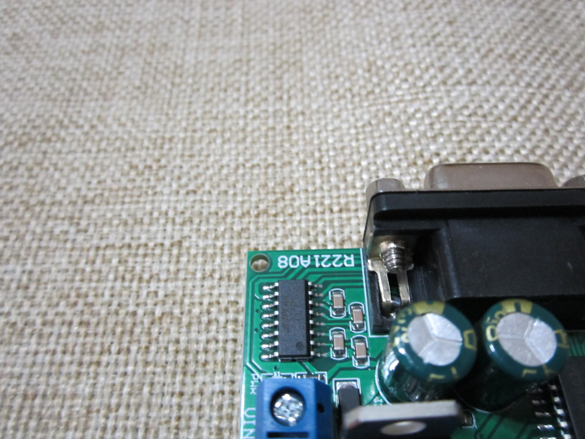
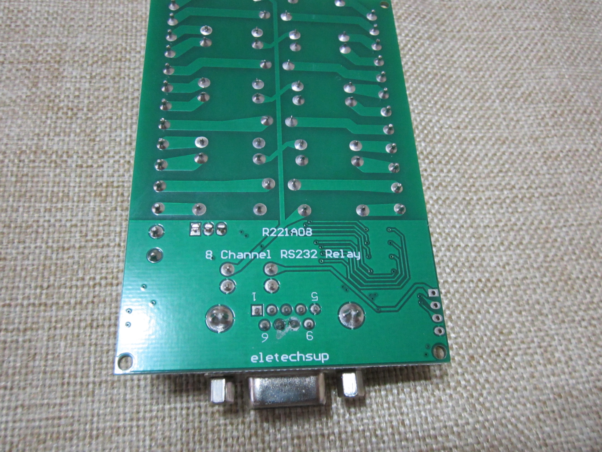

# Serial Relay Controller

## Introduction

Several makes of multi channel relay boards that are controlled over an RS232
serial port. I am testing with a model that uses a ULN2803A chip also noted as
a `darlington array` and an RS232 level shifter chip that is hard to read the
label on.

## Other labels silkscreened on the board:

- R221A08
- 8 Channel RS232 Relay
- eletechsup

## Serial Control Commands

```
0 - Read
1 - Open
2 - Close
3 - Toggle
4 - Momentary ~200ms
5 - Interlock
```

## Usage

```
 ./example_schedule.py 
Use control + c to exit


Reboot the router with a delay
Channel 4 sent operation: off
Channel 4 sent operation: on
^C

Thanks for playing with relays and schedule
```

```
 ./example.py 

Turn on all channels

Channel 1 sent operation: on
Channel 2 sent operation: on
Channel 3 sent operation: on
Channel 4 sent operation: on
Channel 5 sent operation: on
Channel 6 sent operation: on
Channel 7 sent operation: on
Channel 8 sent operation: on

Waiting a few seconds

Turn all the channels off

Channel 1 sent operation: off
Channel 2 sent operation: off
Channel 3 sent operation: off
Channel 4 sent operation: off
Channel 5 sent operation: off
Channel 6 sent operation: off
Channel 7 sent operation: off
Channel 8 sent operation: off

Thanks for using this example

```

```
 ./relay.py 
usage: Serial Relay Controller [-h] (-a | -c {1,2,3,4,5,6,7,8,9,10,11,12,13,14,15,16}) [-o {on,off,toggle,interlock,momentary}]
                               [-b BAUD] [-d DEVICE] [-n {1,2,3,4,5,6,7,8,9,10,11,12,13,14,15,16}]

Serial Relay Controller

optional arguments:
  -h, --help            show this help message and exit
  -a, --all             Select All Channels
  -c {1,2,3,4,5,6,7,8,9,10,11,12,13,14,15,16}, --channel {1,2,3,4,5,6,7,8,9,10,11,12,13,14,15,16}
                        Select Channel
  -o {on,off,toggle,interlock,momentary}, --operation {on,off,toggle,interlock,momentary}
                        Select Operation to Perform
  -b BAUD, --baud BAUD  Select Baud Rate. Defaults to 9600
  -d DEVICE, --device DEVICE
                        Select a Serial Device. Defaults to /dev/ttyUSB0
  -n {1,2,3,4,5,6,7,8,9,10,11,12,13,14,15,16}, --number {1,2,3,4,5,6,7,8,9,10,11,12,13,14,15,16}
                        Select Number of Channels. Defaults to 4

by Andrew lathama Latham
```

```
 ./relay.py -c 1 -o on
Channel 1 sent operation: on
 ./relay.py -c 1 -o on -v
        The command is [85, 86, 0, 0, 0, 1, 1, 173]
Channel 1 sent operation: on
```

### FAQs

- Q: How can I run this as a user?
- A: Add user to dialout group for access to ttyS or ttyUSB devices
   as root `usermod -a -G dialout username` and to activate the group
   change without logging out do a `su - username` to switch user to
   your user with the current env.

- Q: Nothing is working, what is wrong?
- A: Does the relay require external power? Mine needs 12V DC

## Next Steps

1. Add HTTP API demo

## Resources

- https://pyserial.readthedocs.io/en/latest/pyserial_api.html
- https://lathama.net/git/lathama/Serial_Relay_Controller
- https://github.com/lathama/Serial_Relay_Controller
- https://lathama.net/Making/Projects/Serial_Relay_Controller
- https://schedule.readthedocs.io/en/stable/examples.html

## Images

Example serial relay I am using in testing











## Changelog

### 2024-12-31
- Update the schedule library whl, pyserial has had no update.
- Update the README
- Add gitignore
- PEP 257 comments reduce file length
